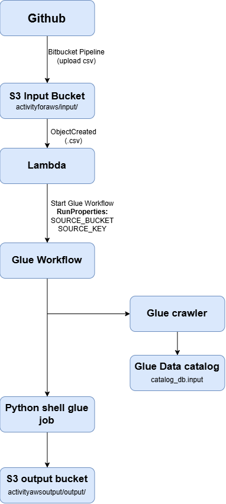

# GitHub AWS Activity — Serverless CSV ETL Pipeline

An event-driven pipeline that watches an S3 bucket for new CSV files, catalogs and transforms
them with AWS Glue, and lands the result as Parquet in an output bucket. Every AWS resource is
defined in one CloudFormation template, and a GitHub Actions workflow deploys it on every push.

## Architecture



## Architecture of glue job
.png>)

### Step by step

**1. A CSV lands in the input bucket.** Files are expected under the `input/` prefix with a
`.csv` suffix — for example `s3://github-aws-activity-input/input/catalog_run1.csv`. That
prefix/suffix pair is the exact filter configured on the bucket notification, so anything
outside `input/*.csv` is ignored.

**2. S3 invokes the Lambda directly.** The bucket's notification configuration points at
`github-aws-activity-lambda` for every `s3:ObjectCreated:*` event matching that filter. An
`AWS::Lambda::Permission` resource grants `s3.amazonaws.com` permission to invoke the function;
without it S3 would silently fail to call it.

**3. The Lambda starts a Glue workflow run.** `lambda/lambda_function.py` reads the bucket and
key off the S3 event, checks the extension is `.csv`, and calls
`glue_client.start_workflow_run()` on `github-aws-activity-workflow`, passing the exact bucket
and key as `RunProperties` (`SOURCE_BUCKET`, `SOURCE_KEY`). That's the mechanism that lets a
Python Shell job — which has no native S3-event trigger of its own — know precisely which file
just arrived, instead of rescanning the whole bucket.

**4. Starting the workflow fires its ON_DEMAND trigger.** `StartTrigger` is the workflow's entry
point; its one action is running `github-aws-activity-crawler` against
`s3://github-aws-activity-input/input/`. The crawler inspects the CSV's schema and creates or
updates a table in the Glue Data Catalog database `github_aws_activity_db` — this is what lets
schema drift (like the extra `hazard_type` column in `catalog_run3.csv`) get picked up
automatically rather than breaking downstream reads.

**5. Crawler success fires the ETL job.** `CrawlerSuccessTrigger` is a `CONDITIONAL` trigger that
watches for the crawler to reach `CrawlState: SUCCEEDED`, then starts
`github-aws-activity-etl`, a Glue Python Shell job (`glue/ETLtrialJob.py`).


**6. The job transforms only the new file.** Rather than processing every file in the bucket,
the job calls `get_workflow_run_properties()` to retrieve the `SOURCE_BUCKET`/`SOURCE_KEY` the
Lambda set in step 3, reads exactly that object with pandas, parses the `date` column, derives a
`year` column, and writes the result as Parquet to
`s3://github-aws-activity-output/output/output.parquet`.

Each of these five hand-offs is an independent AWS service reacting to a state change in the
previous one — S3 notification → Lambda invocation → Glue workflow run → crawler completion →
job start — rather than one long-running process, which is what makes the whole thing
serverless and pay-per-event.


## What the CloudFormation stack owns

`cloudformation/template.yaml` is deployed as a single stack (`github-aws-activity-stack`) and
is the only source of truth for every resource above. Nothing in this pipeline is created by
hand or by ad-hoc CLI calls anymore — it's all provisioned, updated, and torn down as one unit:

- **S3 buckets** — `InputBucket` and `OutputBucket`, both with public access fully blocked.
- **IAM roles** — `LambdaRole` (used by both Lambda functions) and `GlueRole` (used by the
  crawler and job), each with an inline policy scoped to just the actions and resources they
  need (S3 read/write on the two buckets, Glue Data Catalog and workflow actions, CloudWatch
  Logs).
- **Glue Data Catalog** — the database, the crawler, and the Python Shell job.
- **Glue Workflow and triggers** — the workflow itself, the `ON_DEMAND` `StartTrigger`, and the
  `CONDITIONAL` `CrawlerSuccessTrigger`.
- **Two Lambda functions** — `github-aws-activity-lambda` (the actual event handler described
  above) and `S3NotificationFunction`, a small helper.
- **The S3 → Lambda wiring** — an `AWS::Lambda::Permission` plus a custom resource,
  `ConfigureBucketNotification`.

### Why there's a second, "invisible" Lambda

CloudFormation has no native `AWS::S3::BucketNotification` resource, and setting a
`NotificationConfiguration` directly on the `AWS::S3::Bucket` resource would create a circular
dependency (the bucket would need to know the Lambda's ARN, and the Lambda's permission would
need to know the bucket's ARN, each waiting on the other). The template works around this with a
custom resource: `S3NotificationFunction` is a tiny Lambda whose only job is to call
`put_bucket_notification_configuration()` on the input bucket, pointed at the *real* Lambda's
ARN. CloudFormation invokes it once after the bucket, the real Lambda, and its invoke permission
all exist (`ConfigureBucketNotification`'s `DependsOn`), and again on stack deletion to clear the
notification before the bucket is removed. It never appears in the AWS Console's list of things
you "use" — it only exists to do this one wiring step during deploys and teardowns.

## What's automated in the pipeline

Four GitHub Actions workflows cover the full lifecycle — nothing needs to be run from a local
terminal:

| Workflow | Trigger | What it does |
|---|---|---|
| `deploy.yml` | Push to `main` touching the template, Lambda, or Glue script; or manual | Validates and deploys the CloudFormation stack, uploads `glue/ETLtrialJob.py` to the input bucket's `scripts/` prefix, then verifies every resource exists. |
| `process.yml` | Manual, pick one of the three sample CSVs | Uploads a single CSV to `input/`, which is the real end-to-end trigger for the whole pipeline described above. |
| `destroy.yml` | Manual, requires typing `DESTROY` | Empties both S3 buckets, deletes the CloudFormation stack, waits for deletion to finish, cleans up the two Lambda log groups CloudFormation doesn't own, and confirms the stack is gone. |
| `cleanup-legacy.yml` | Manual, requires typing `CLEANUP` | One-time workflow for resources left over from the pre-CloudFormation phase (see below) or a stack stuck in `ROLLBACK_COMPLETE`. |

`deploy.yml` is the only one that runs automatically; the other three are deliberately manual
(`workflow_dispatch`) since uploading test data or tearing down infrastructure shouldn't happen
on every push.

## How this project got here

The pipeline went through three distinct phases, visible in the repo's git history:

1. **Manual setup.** The buckets, IAM roles, Glue database/crawler/job/workflow, and Lambda were
   first created by hand in the AWS Console to prove the design worked end to end.

2. **A plain GitHub Actions pipeline.** That manual setup was then translated, step by step,
   into an imperative `deploy.yml` that ran `aws` CLI commands directly — creating trust
   policies, IAM roles and managed policies, the buckets, the Glue database/crawler/job/workflow
   and the Lambda, one `aws iam create-role` / `aws glue create-crawler` / etc. call at a time.
   The JSON files still sitting in `policies/` (`lambda-policy.json`, `glue-policy.json`,
   `github-actions-policy.json`) are artifacts of that phase — they document what the CLI-created
   IAM policies looked like, but nothing in the current pipeline reads them anymore.

3. **CloudFormation.** The imperative CLI steps were replaced with the single declarative
   template now in `cloudformation/template.yaml`, and `deploy.yml` shrank to essentially one
   command: `aws cloudformation deploy`. This is what makes the current `destroy.yml` possible —
   CloudFormation tracks every resource it created as one stack, so tearing it down is one
   `delete-stack` call instead of manually reversing a dozen CLI commands in the right order.
   `cleanup-legacy.yml` exists specifically to remove the resources phase 2 created outside of
   CloudFormation's management, so they don't collide with the stack trying to create resources
   of the same name.

## Repository layout

```
cloudformation/template.yaml    CloudFormation stack — every AWS resource described above
lambda/lambda_function.py       Reference copy of the processing Lambda's code
                                 (the deployed code is inlined in the template — see note below)
glue/ETLtrialJob.py             The Glue Python Shell ETL job
CreatingCSV/                    CSVCreation.py generates the 3 sample CSVs used by process.yml
policies/                       Leftover IAM policy JSON from the pre-CloudFormation phase (unused)
.github/workflows/              deploy.yml, process.yml, destroy.yml, cleanup-legacy.yml
```

**Note:** both Lambda functions are deployed via inline `ZipFile` code directly in
`template.yaml`, not by zipping and uploading `lambda/lambda_function.py`. That file is kept in
the repo as a readable reference, but editing it alone has no effect on what's deployed — changes
need to be mirrored into the template's inline code.

## Running it

- **Deploy:** push to `main` with a change under `cloudformation/`, `glue/`, or `lambda/`, or run
  `deploy.yml` manually from the Actions tab.
- **Test the trigger:** run `process.yml` manually and pick one of `catalog_run1.csv`,
  `catalog_run2.csv`, or `catalog_run3.csv`. Watch the Lambda's CloudWatch log group
  (`/aws/lambda/github-aws-activity-lambda`) and the workflow's run history in the Glue console
  to follow it through the crawler and the ETL job.
- **Tear down:** run `destroy.yml` manually, typing `DESTROY` when prompted. No local AWS CLI
  access is needed for any of this.

# first run:


# output in paraquet format:


# github actions:


# pipelines:


# on running destroy pipeline:


# after that running the deploy pipeline again:


## running the pipeline to uplad csv-first csv file with 4 columns


# buckets created


# input bucket


# crawler loading to catalog


# output bucket:


## running the pipeline to uplad csv-third csv file with 5 columns

# input bucket:


# same catalog gets updated 


